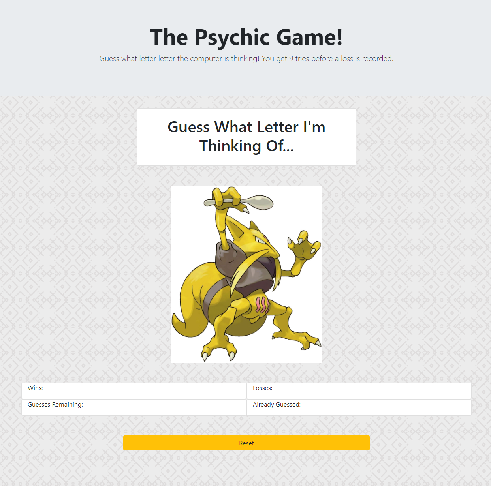
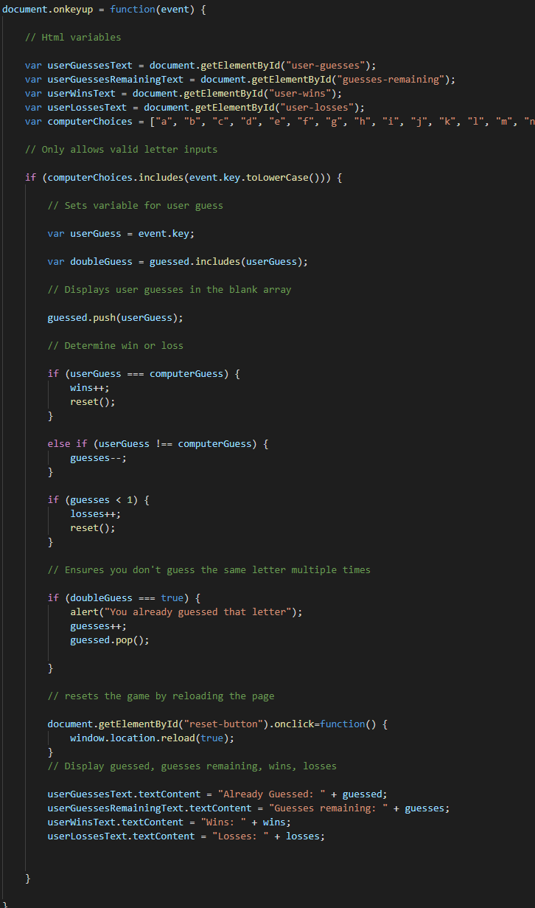

# Psychic-Game

## About

This application makes use of javascript to create a game in which the computer randomly guesses a letter and the user gets 9 tries to guess the letter the computer is thinking of.

## Demo

Example: [CLICK HERE](https://nicholasherrick.github.io/Psychic-Game/.) to view the application

## Build Tools

*HTML

*CSS

*Bootstrap

*Javascript
